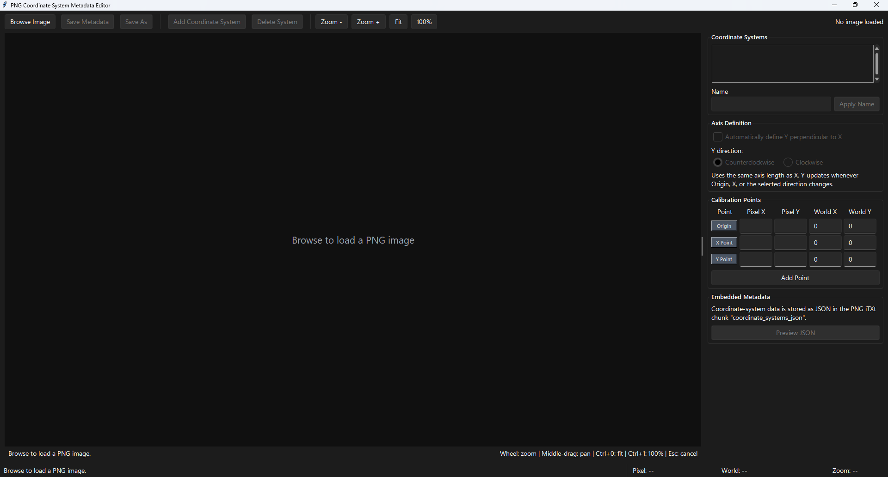
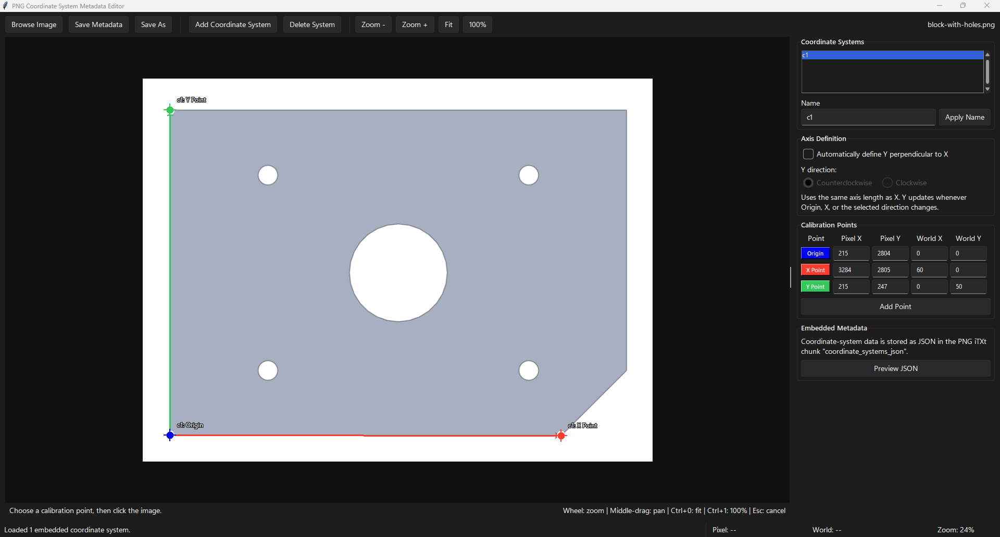
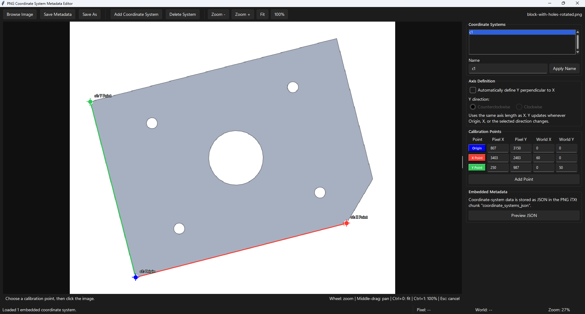
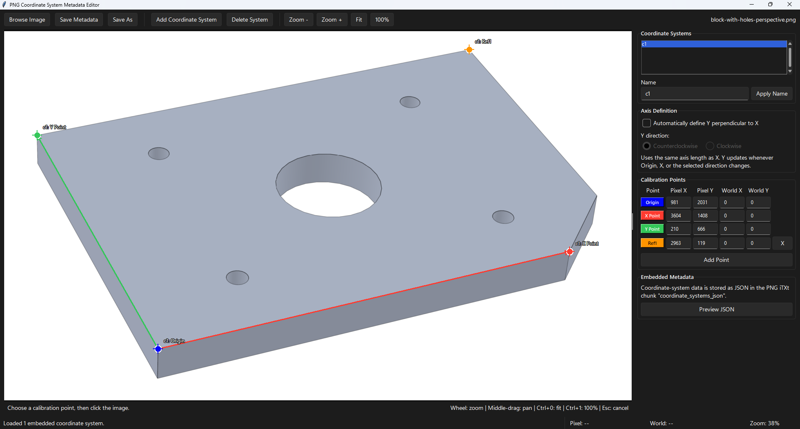

# Image Coordinate Editor

A desktop application for defining real-world coordinate systems on PNG images and storing the calibration as embedded metadata.

## Features

- Define multiple named coordinate systems in one image.
- Place Origin, X Point, and Y Point calibration points.
- Add any number of color-coded reference points.
- Edit pixel and world coordinates in a compact table.
- Use affine calibration with three complete point pairs.
- Use perspective calibration with four or more complete point pairs.
- Display live pixel and world coordinates under the cursor.
- Zoom, pan, fit, and inspect large PNG images.
- Preserve existing PNG text metadata, EXIF, ICC profiles, and DPI where practical.
- Convert coordinates in both directions with `pixel_to_world()` and `world_to_pixel()`.

## Requirements

- Python 3.11 or newer
- Tkinter
- Pillow

## Installation

From the repository root:

```powershell
python -m venv .venv
.\.venv\Scripts\Activate.ps1
python -m pip install --upgrade pip
pip install -e ".[dev]"
```

## Running the editor

```powershell
image-coordinate-editor
```

Alternatively:

```powershell
python -m image_coordinate_editor
```

Use **Browse Image** to load a PNG. Enter the world coordinates for Origin, X Point, and Y Point, then select the matching locations in the image. Use **Add Point** when perspective calibration requires additional pixel/world correspondences. Save the image to embed the coordinate metadata.

## Calibration models

A coordinate system always contains these three fixed points:

- `origin`
- `x_point`
- `y_point`

Additional points are stored in `reference_points` and displayed as `Ref1`, `Ref2`, and so on.

With three complete, non-collinear points, the library calculates an affine transformation. With four or more complete points, it calculates a projective homography that accounts for perspective. Extra reference points are included in a least-squares fit.

Pixel coordinates use a top-left origin, with X increasing right and Y increasing down. World-coordinate direction and scale are determined by the calibration values entered by the user.

## Embedded metadata

Coordinate systems are stored as JSON in the PNG iTXt field `coordinate_systems_json`. A simplified coordinate system looks like this:

```json
{
  "name": "Fixture",
  "origin": {
    "pixel_x": 215.0,
    "pixel_y": 2804.0,
    "world_x": 0.0,
    "world_y": 0.0
  },
  "x_point": {
    "pixel_x": 3284.0,
    "pixel_y": 2805.0,
    "world_x": 60.0,
    "world_y": 0.0
  },
  "y_point": {
    "pixel_x": 215.0,
    "pixel_y": 247.0,
    "world_x": 0.0,
    "world_y": 50.0
  },
  "reference_points": [
    {
      "pixel_x": 2963.0,
      "pixel_y": 119.0,
      "world_x": 60.0,
      "world_y": 50.0
    }
  ]
}
```

The complete payload also records the schema version, image dimensions, and pixel-axis conventions. See [examples/sample_coordinate_metadata.json](examples/sample_coordinate_metadata.json) for another sample.

## Plotting world-coordinate data

The examples demonstrate how another program can read a PNG's embedded coordinate system and plot world-coordinate measurements on the image. Each example defines the same data points in world coordinates:

```python
WORLD_POINTS = [
    ("P1", 10.0, 10.0),
    ("P2", 30.0, 10.0),
    ("P3", 50.0, 10.0),
    ("P4", 10.0, 30.0),
    ("P5", 30.0, 30.0),
    ("P6", 50.0, 30.0),
]
```

For each point, the script reads the embedded metadata and projects the world coordinate into image pixels:

```python
from PIL import Image

from image_coordinate_editor.png_metadata import read_coordinate_metadata
from image_coordinate_editor.transforms import world_to_pixel

with Image.open(image_path) as image:
    coordinate_system = read_coordinate_metadata(image)[0]

pixel, coefficients = world_to_pixel(
    coordinate_system,
    world_x=30.0,
    world_y=10.0,
)
```

Run the three examples from the repository root:

```powershell
python examples\plot-points_block-with-holes.py
python examples\plot-points_block-with-holes-rotated.py
python examples\plot-points_block-with-holes-perspective.py
```

They produce:

- `examples/output/block-with-holes-points.png`
- `examples/output/block-with-holes-rotated-points.png`
- `examples/output/block-with-holes-perspective-points.png`

The straight, rotated, and perspective images place the same world-coordinate dataset at different pixel locations according to each image's calibration.

## Coordinate conversion API

Use `pixel_to_world()` to interpret an image location in world coordinates:

```python
from image_coordinate_editor.transforms import pixel_to_world

world, coefficients = pixel_to_world(coordinate_system, pixel_x=1200, pixel_y=800)
```

Use `world_to_pixel()` to overlay world-coordinate data on the image:

```python
from image_coordinate_editor.transforms import world_to_pixel

pixel, coefficients = world_to_pixel(coordinate_system, world_x=25.0, world_y=15.0)
```

Both functions return the result and reusable transform coefficients. Pass the coefficients into subsequent calls when converting many points with the same coordinate system.

## Screenshots









## Tests and linting

```powershell
pytest
ruff check .
```

## Project layout

```text
src/image_coordinate_editor/
|-- __main__.py
|-- app.py
|-- models.py
|-- png_metadata.py
`-- transforms.py

examples/
|-- images/
|-- output/
|-- plot-points_block-with-holes.py
|-- plot-points_block-with-holes-rotated.py
`-- plot-points_block-with-holes-perspective.py
```
